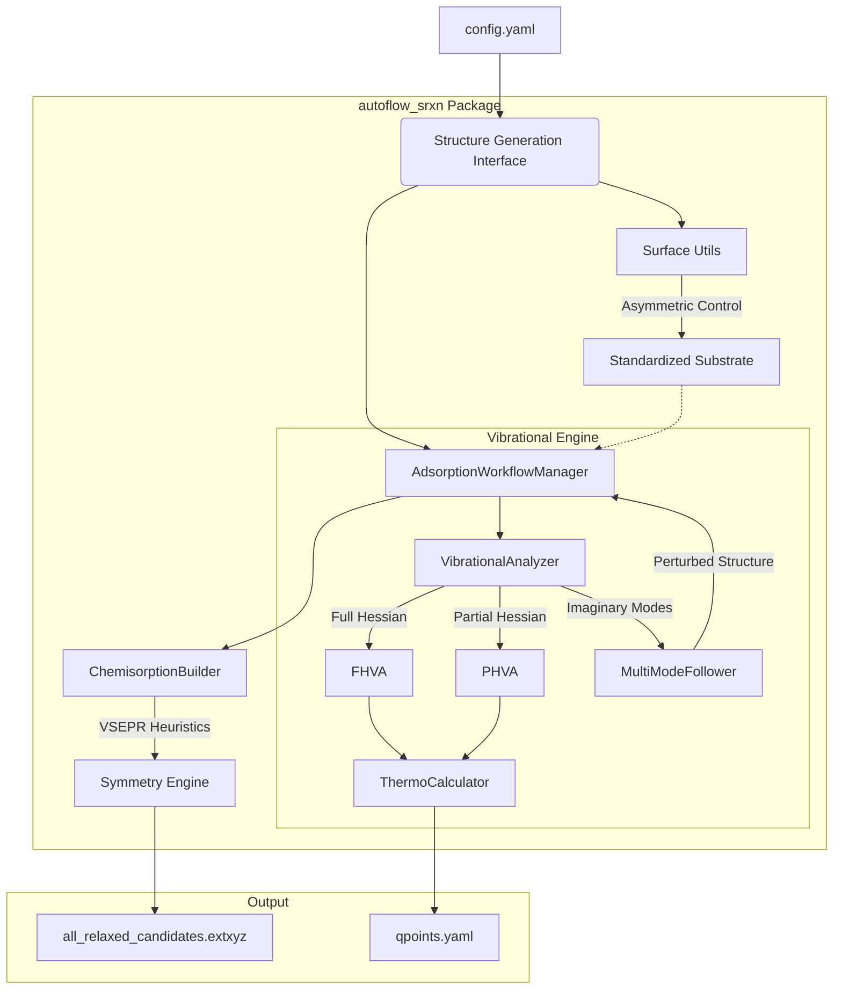

# AutoFlow-SRXN: Automated Surface Reaction Workflow

**AutoFlow-SRXN** is a high-fidelity, fully-automated framework designed for high-throughput exploration and generation of adsorption and reaction structures between arbitrary precursors and substrates. It leverages geometric coordination principles, machine learning interatomic potentials (MLIPs), and statistical mechanics to predict thermodynamic stability and reaction kinetics at material interfaces.

---

## 1. Scientific Domain Expertise

### 1.1 Multi-Vector VSEPR Coordination Engine
The framework utilizes a generalized, valence shell electron pair repulsion (VSEPR) based engine to autonomously detect and passivate undercoordinated surface sites across arbitrary materials.

For a surface atom $i$ with $n$ existing covalent neighbors and a target valence $V_{target}$, the engine identifies $m = V_{target} - n$ dangling bonds. The 3D orientation of these vectors is determined algorithmically:
- **Singular Bonds ($m=1$)**: Points exactly opposite to the normalized sum of existing neighbor vectors.
- **Dual Bonds ($m=2$)**: Optimized for tetrahedral/square-planar environments (e.g., Si(100) dimers), spreading vectors according to $AX_2E_2$ VSEPR geometry.
- **Surface Saturation ($m \ge 3$)**: Distributes vectors in a symmetric conical spread around the primary vacuum-pointing axis.

### 1.2 Asymmetric Substrate Factory
The framework automates the generation of complex surface models with precise termination control.
- **Asymmetric Termination**: Supports separate atomic plane constraints for top and bottom surfaces (e.g., Silanol-terminated top vs. Oxygen-terminated bottom).
- **Side-Specific Passivation**: Enables independent passivation coverage for different sides of the slab, critical for modeling realistic asymmetric experimental conditions.
- **Steric-Constraint Expansion**: Autonomously expands the supercell to satisfy a `target_area` constraint, ensuring periodic boundary stability for large adsorbates like DIPAS.

### 1.3 Partial Hessian Vibrational Analysis (PHVA)
To accelerate thermodynamic calculations and kinetic modeling, the framework implements **Partial Hessian Vibrational Analysis**.
For a system with $N_{total}$ atoms, the full Hessian matrix $H \in \mathbb{R}^{3N \times 3N}$ is approximated by a submatrix $H_{active} \in \mathbb{R}^{3N_{active} \times 3N_{active}}$:
$$ H_{ij} \approx 0 \quad \text{if } i \text{ or } j \notin \text{Active Set} $$
The **Active Set** is dynamically defined as the adsorbate plus all substrate atoms within a user-defined cutoff radius $R_{phva}$ (default 6.0 Å), significantly reducing the number of force calls required for frequency extraction.

### 1.4 Thermodynamics & Gibbs Free Energy
The engine integrates vibrational data to calculate finite-temperature thermodynamic properties using the Harmonic approximation.
- **Vibrational Partition Function**: $Z_{vib} = \prod_i \frac{e^{-\beta \hbar \omega_i / 2}}{1 - e^{-\beta \hbar \omega_i}}$
- **Gibbs Free Energy**: $G(T) = E_{pot} + ZPE + \int C_p dT - TS$

### 1.5 Iterative Mode-Following Refinement
To ensure all generated structures represent true local minima, the framework implements an iterative mode-following algorithm. If a relaxed structure contains imaginary vibrational modes (frequency < -0.1 THz), the system is autonomously perturbed along the Cartesian displacement vector $\mathbf{u}_k$ of the most unstable mode:
$$ \mathbf{R}_{new} = \mathbf{R}_{old} + \alpha \frac{\mathbf{u}_k}{\|\mathbf{u}_k\|} $$
where $\mathbf{u}_{k,i} = \mathbf{e}_{k,i} / \sqrt{m_i}$ is derived from the mass-weighted eigenvector $\mathbf{e}_k$. The process repeats until all significant imaginary frequencies are eliminated.

---

## 2. Strategic Objectives
- **High-Throughput Exploration**: Rational search of the potential energy surface (PES) using symmetry-aware site identification.
- **MLIP-Driven Accuracy**: High-fidelity relaxation and frequency calculations using **MACE-MP** and **SevenNet** foundation models.
- **PHVA/FHVA Benchmarking**: Systematic validation of partial Hessian approximations against full Hessian references.
- **Standardized Data Export**: Generation of human-readable `qpoints.yaml` files and `all_relaxed_candidates.extxyz` for visualization.

---

## 3. Architecture Map

### 3.1 Logical Data Flow


### 3.2 Simulation Backend Design

All relaxation and force calculations are routed through `SimulationEngine` (`src/potentials.py`), which selects an ASE-compatible backend based on `engine.potential.backend` in the configuration. The framework follows a **pure ASE (In-process) architecture**, eliminating external binary dependencies (like LAMMPS) for improved portability and stability.

| Backend | Model | Runtime | Interface |
| :--- | :--- | :--- | :--- |
| **MACE** | MACE-MP-0 | In-process Python | `mace.calculators.mace_mp` |
| **SevenNet** | 7net-0 / multifidelity | In-process Python | `sevenn.calculator.SevenNetCalculator` |
| **EMT** | Standard EMT | In-process Python | `ase.calculators.emt.EMT` |
| **ZBL** | Screened Coulomb (any backend) | In-process Python | `src/potentials.ZBLCalculator` |

**MACE** is loaded as an ASE calculator and runs entirely within the Python process. It supports both `float32` (for fast MD) and `float64` (for precise vibrations). D3 dispersion correction is enabled via `TorchDFTD3Calculator` when `d3: true`.

**SevenNet** is driven through the `sevenn` ASE interface. It supports optional D3 dispersion corrections via `SevenNetD3Calculator`. Only non-default flags (`enable_cueq`, `enable_flash`, `modal`) are forwarded to the constructor so the engine remains compatible across SevenNet versions.

**ZBL repulsion** (Ziegler-Biersack-Littmark screened Coulomb) can be layered on top of any backend via `zbl.enabled: true`. The ZBL contribution is active only at very short range and is smoothly switched off so it does not interfere with the MLIP at ordinary bonding distances. Internally the engine uses ASE's `SumCalculator([base_calc, ZBLCalculator(...)])` so both MACE and SevenNet are fully supported.

Per-pair outer switching distances are stored in `src/zbl_pairs.json` for 14 chemically relevant elements (Al, C, Cl, Cu, Fe, H, Hf, N, O, P, S, Si, Ti, Zr). Each value is set to approximately the equilibrium bond length (Pyykko & Atsumi single-bond radii, scaled by 1.056) so ZBL is essentially inactive at normal bonding distances and only activates at sub-bonding close contacts. Element pairs absent from the file fall back to the global `cutoff_outer` parameter.

**Configuration:**
```yaml
engine:
  potential:
    backend: "mace"      # "mace" | "sevennet" | "emt"
    device:  "cpu"       # "cpu" | "cuda"
    dtype:   "float64"   # "float32" (MD) | "float64" (geometry opt / vibrations)
    model:   null        # null -> use default foundation model
    modal:   null        # multi-fidelity modality (SevenNet only)
    d3:      false       # true -> enable D3 dispersion correction
    enable_cueq:  false  # enable cuEquivariance (SevenNet only)
    enable_flash: false  # enable FlashAttention  (SevenNet only)
    zbl:                 # Ziegler-Biersack-Littmark short-range repulsion
      enabled:      false   # true  -> MLIP + ZBL combination
      cutoff_inner: 0.5     # Å – ZBL fully active below this
      cutoff_outer: 2.5     # Å – global fallback; per-pair values in src/zbl_pairs.json
```

### 3.3 Directory Structure
- `src/`: Core package logic (surface utils, adsorption managers, vibration analysis).
  - `zbl_pairs.json`: Per-pair ZBL outer switching cutoffs for 14 elements (Al, C, Cl, Cu, Fe, H, Hf, N, O, P, S, Si, Ti, Zr).
- `examples/`:
    - `partial_hamiltonian_vibrational_analysis/`: Full PHVA vs FHVA benchmark on SiO2(001) + DIPAS.
    - `mode_following_relaxation/`: Automated stability refinement of the DIPAS precursor.
    - `example_dipas/`: Si(100) surface reaction stage-wise discovery.
    - `physisorption_vibration/`: Physisorption vibrational analysis example.
- `structures/`: Base crystal and precursor configurations (VASP format).
- `unittests/`: Unit test suite for potential engines and ZBL calculator.

---

## 4. Operational Harness

### 4.1 Installation
```bash
pip install -e .
pip install ".[mace]"     # MACE-MP support
pip install sevenn         # SevenNet support
```

### 4.2 Running PHVA Benchmark
To run the PHVA vs FHVA free-energy benchmark on a silanol-terminated SiO2 surface:
```bash
cd examples/partial_hamiltonian_vibrational_analysis
python run_phva_benchmark.py
```
This script will:
1. Generate an asymmetric SiO2(001) slab and equilibrate with MD at 500 K.
2. Relax the gas-phase DIPAS molecule in isolation.
3. Search for physisorption sites, relax the top 8 candidates, and select the lowest-energy structure.
4. Run FHVA (full Hessian) on the gas molecule and adsorbed system.
5. Run PHVA (partial Hessian, active set = adsorbate + slab atoms within 6.0 Å) on the adsorbed system.
6. Save individual `qpoints.yaml` files for each system in `vibrations/`.
7. Compute ΔG_rxn(FHVA) and ΔG_rxn(PHVA) via the harmonic-oscillator approximation and write `results/phva_fhva_comparison.yaml`.

### 4.3 Running Unit Tests
```bash
python -m unittest unittests/test_potentials.py -v
```

---

## 5. Physical Standards

| Property | Standard Unit | Reference |
| :--- | :--- | :--- |
| **Energy** | Electronvolt (eV) | - |
| **Frequency** | Wavenumber (cm⁻¹) | 1 THz $\approx$ 33.356 cm⁻¹ |
| **Distance** | Angstrom (Å) | - |
| **Temperature**| Kelvin (K) | Default: 298.15 K |

**DOIs & References:**
- MACE Potential: [10.48550/arXiv.2206.07697]
- SevenNet: [10.1021/acs.jctc.4c00190]
- ASE Framework: [10.1088/1361-648X/aa680e]
- Pyykko & Atsumi covalent radii (ZBL pair DB): [10.1002/chem.200800987]
