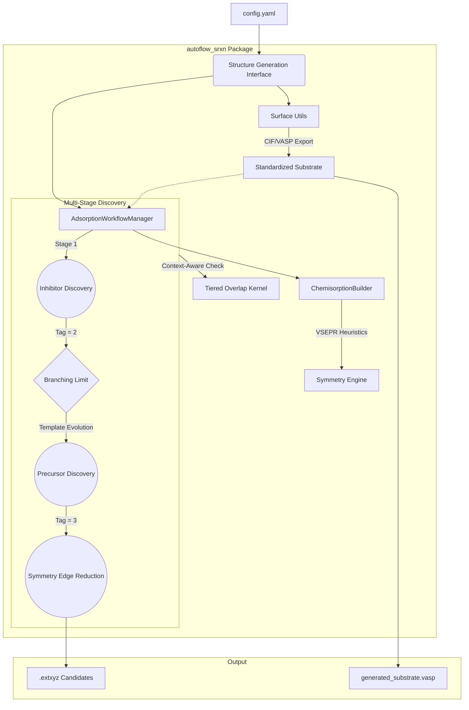

# AutoFlow-SRXN: Automated Surface Reaction Workflow

**AutoFlow-SRXN** is a high-fidelity, fully-automated framework designed for high-throughput exploration and generation of adsorption and reaction structures between arbitrary precursors and substrates. It leverages geometric coordination principles and statistical mechanics to predict thermodynamic stability and reaction pathways at material interfaces.

---

## 1. Scientific Domain Expertise

### 1.1 Multi-Vector VSEPR Coordination Engine
The framework utilizes a generalized, valence shell electron pair repulsion (VSEPR) based engine to autonomously detect and passivate undercoordinated surface sites across arbitrary materials.

For a surface atom $i$ with $n$ existing covalent neighbors and a target valence $V_{target}$, the engine identifies $m = V_{target} - n$ dangling bonds. The 3D orientation of these vectors is determined algorithmically:
- **Singular Bonds ($m=1$)**: Points exactly opposite to the normalized sum of existing neighbor vectors.
- **Dual Bonds ($m=2, n=2$)**: Optimized for tetrahedral/square-planar environments (e.g., Si(100) dimers), spreading vectors according to $AX_2E_2$ VSEPR geometry.
- **Surface Saturation ($m \ge 3$)**: Distributes vectors in a symmetric conical spread around the primary vacuum-pointing axis.

### 1.2 Multi-Element Passivation
Beyond hydrogen, the engine support arbitrary passivation elements (F, Cl, O, etc.). Bond lengths are dynamically determined using the sum of covalent radii:
$$ d_{ij} = r_{cov, i} + r_{cov, j} $$

### 1.3 Thermodynamics & Gibbs Free Energy
The engine integrates vibrational data from Phonopy to calculate finite-temperature thermodynamic properties.
... (equations unchanged) ...

### 1.4 Surface Protector Interaction Model
The framework employs a spatial and heuristic engine to model surface interactions in the presence of protective layers (e.g., SAMs).
- **Void-Space Penetration**: Uses a 3D Distance Transform Voxel Grid to autonomously locate steric cavities (voids) within dense protector canopies, enabling targeted physisorption and accessibility-filtered chemisorption deep on the base substrate.
- **Protector Ligand Exchange**: Simulates direct reactions with the protector layer by algorithmically identifying reactive leaves (e.g., `-OH`, `-Cl`) and performing substituent exchange. Stoichiometric byproducts (e.g., $HCl$) are automatically isolated into an independent simulation cell.

### 1.5 Automated Substrate Factory
The framework automates the transition from bulk crystals to surface slabs through integrated geometric calculations.
- **Miller-to-Slab Calculation**: Generates oriented slabs from arbitrary $(h, k, l)$ Miller indices, automatically calculating layer requirements to satisfy a target physical thickness.
- **Steric-Constraint Expansion**: Autonomously expands the surface area to satisfy a `target_area` constraint (e.g., $160 \, \text{\AA}^2$) while maximizing lattice squareness to optimize periodic boundary interaction.
- **Symmetric Termination Search**: Performs a fractional coordinate grid search along the surface normal to identify stoichiometric or chemically symmetric termination planes.
- **Lattice Vector Alignment**: Automatically rotates the generated supercell to align the primary lattice vector with the X-axis $(1, 0, 0)$ for standardized coordinate management.

### 1.6 Stage-Wise Surface Evolution & Competitive Adsorption
The framework supports sequential discovery stages to model complex surface phenomena such as competitive inhibition or multi-step ALD/ALE processes.
- **Dynamic Branching Workflow**: Top-ranked inhibited geomorphologies from Stage 1 (e.g., Inhibitors/SAMs) are automatically promoted as substrate templates for Stage 2 (e.g., Precursors), enabling the exploration of cooperative or resistive site-blocking effects.
- **Context-Aware Steric Filtering**: Implements a tiered distance-threshold kernel $K(\delta)$ based on atomic tags:
  - **Molecule-Substrate $(\delta \approx 1.5\,\text{\AA})$**: Permissive threshold ensuring molecules can reach the surface potential wells.
  - **Inter-Molecular $(\delta \approx 2.0-2.5\,\text{\AA})$**: Configurable threshold (typically $\approx \text{Sum of VdW Radii}$) to prevent non-physical clashing in crowded interfacial environments.

### 1.7 MACE-MP-0 Relaxation Engine
The framework integrates the **MACE (Multi-ACE)** foundation models for high-fidelity structural relaxation and energy extraction.
- **Foundation Model Support**: Utilizes the `mace_mp` medium model by default, providing near-DFT accuracy for arbitrary chemical species.
- **Converged Geometry Optimization**: Implements an automated relaxation loop using ASE optimizers (BFGS/FIRE) with a force convergence criterion (default $0.05\,\text{eV/\AA}$).
- **Lazy Loading Implementation**: Optimized for Windows environments to resolve DLL initialization issues, ensuring seamless MLIP execution.

---

## 2. Strategic Objectives
- **High-Throughput Exploration**: Rational search of the potential energy surface (PES) for complex surface-molecule interactions.
- **MLIP-Driven Structural Optimization**: High-fidelity relaxation of adsorption candidates using MACE-MP-0 models.
- **Multi-Stage Discovery & Branching**: Systematic exploration of precursor adsorption on inhibited or pre-functionalized surface templates.
- **Standardized VASP Export**: Automated Z-alignment ($z_{min}=0.5\,\text{\AA}$) and atomic sorting for all structural outputs.
- **Context-Aware Overlap Control**: Precise steric management for high-density interfacial modeling.

---

## 3. Architecture Map

### 3.1 Logical Data Flow


### 3.2 Directory Structure
- `src/autoflow_srxn/`: Core package logic (Coordination, collision, MLIP potentials).
- `setup.py` / `pyproject.toml`: Package installation and dependency management.
- `free_energy/`: Statistical mechanics engine for thermodynamic property parsing.
- `example_dipas/`: Executable sandbox for Si(100) surface manipulation and validation.
- `structures/`: Storage for precursor and substrate base configurations.

---

## 4. Operational Harness

### 4.1 Installation
The framework is now structured as a standard Python package. It is recommended to use a virtual environment.

**Step 1: Environment Setup**
```bash
python -m venv .venv
source .venv/bin/activate  # 或 .venv\Scripts\activate (Windows)
```

**Step 2: Install Package**
```bash
# Basic installation (dependencies only)
pip install .

# Installation with MACE-MP support (torch/MLIP)
pip install ".[mace]"
```

### 4.2 Standard Workflow (example_dipas)
To execute the multi-stage reaction simulation on the Si(100) surface:

1. **Configure**: Edit `example_dipas/config_full.yaml` to set your physical parameters (termination, thickness, etc.).
2. **Execute**:
   ```bash
   cd example_dipas
   python run.py
   ```
3. **Verify Stages**:
   - **Stage 0**: Raw substrate is generated and saved as `generated_substrate.vasp`.
   - **Stage 1**: Surface is passivated/inhibited and saved as `passivated.vasp`.
   - **Stage 2**: Adsorption candidates for the precursor are generated in `.extxyz` format. 

### 4.3 Thermodynamic Post-Processing
To calculate the Gibbs Free Energy at $T=298.15K$:
```bash
cd free_energy
python analyze_thermo.py phonopy.yaml --energy -14.50 --mode gas --mass 18.02
```

### 4.3 Thermodynamic Post-Processing
To calculate the Gibbs Free Energy at $T=298.15K$:
```bash
cd free_energy
python analyze_thermo.py phonopy.yaml --energy -14.50 --mode gas --mass 18.02
```

---

## 5. Physical Standards

| Property | Standard Unit | Alternative/Scale |
| :--- | :--- | :--- |
| **Energy** | Electronvolt (eV) | kJ/mol, Hartree |
| **Length** | Angstrom (Å) | Bohr |
| **Temperature** | Kelvin (K) | - |
| **Mass** | Atomic Mass Unit (amu) | kg |
| **Frequency** | Terahertz (THz) | wavenumber (cm⁻¹) |
| **Pressure** | Pascal (Pa) | atm (101325 Pa) |

**Physical Constants (CODATA 2018):**
- Boltzmann Constant ($k_B$): $1.380649 \times 10^{-23}$ J/K
- Planck Constant ($h$): $6.62607015 \times 10^{-34}$ J·s
- Gas Constant ($R$): $8.314462618$ J/(mol·K)
- Avogadro Number ($N_A$): $6.02214076 \times 10^{23}$ mol⁻¹
