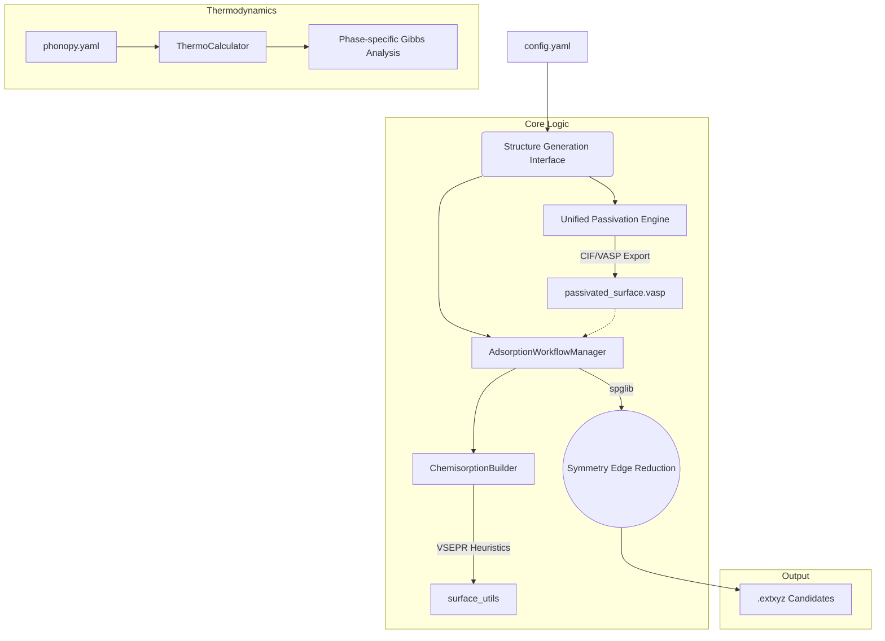

# AutoFlow-SRXN: Automated Surface Reaction Workflow

**AutoFlow-SRXN** is a high-fidelity, fully-automated framework designed for high-throughput exploration and generation of adsorption and reaction structures between arbitrary precursors and substrates. It leverages geometric coordination principles and statistical mechanics to predict thermodynamic stability and reaction pathways at material interfaces.

---

## 1. Scientific Domain Expertise

### 1.1 Multi-Vector VSEPR Coordination Engine
The framework utilizes a generalized, valence shell electron pair repulsion (VSEPR) based engine to autonomously detect and passivate undercoordinated surface sites across arbitrary materials.

For a surface atom $i$ with $n$ existing covalent neighbors and a target valence $V_{target}$, the engine identifies $m = V_{target} - n$ dangling bonds. The 3D orientation of these vectors is determined algorithmically:
- **Singular Bonds ($m=1$)**: Points exactly opposite to the normalized sum of existing neighbor vectors.
- **Dual Bonds ($m=2, n=2$)**: Optimized for tetrahedral/square-planar environments (e.g., Si(100) dimers), spreading vectors according to $AX_2E_2$ VSEPR geometry.
- **Surface Saturation ($m \ge 3$)**: Distributes vectors in a symmetric conical spread around the primary vacuum-pointing axis.

### 1.2 Multi-Element Passivation
Beyond hydrogen, the engine support arbitrary passivation elements (F, Cl, O, etc.). Bond lengths are dynamically determined using the sum of covalent radii:
$$ d_{ij} = r_{cov, i} + r_{cov, j} $$

### 1.3 Thermodynamics & Gibbs Free Energy
The engine integrates vibrational data from Phonopy to calculate finite-temperature thermodynamic properties.
... (equations unchanged) ...

### 1.4 Surface Protector Interaction Model
The framework employs a spatial and heuristic engine to model surface interactions in the presence of protective layers (e.g., SAMs).
- **Void-Space Penetration**: Uses a 3D Distance Transform Voxel Grid to autonomously locate steric cavities (voids) within dense protector canopies, enabling targeted physisorption and accessibility-filtered chemisorption deep on the base substrate.
- **Protector Ligand Exchange**: Simulates direct reactions with the protector layer by algorithmically identifying reactive leaves (e.g., `-OH`, `-Cl`) and performing substituent exchange. Stoichiometric byproducts (e.g., $HCl$) are automatically isolated into an independent simulation cell.

---

## 2. Strategic Objectives
- **High-Throughput Exploration**: Rational search of the potential energy surface (PES) for complex surface-molecule interactions.
- **Automated Dataset Generation**: Systematic generation of unique structural configurations for training Machine Learning Interatomic Potentials (MLIPs).
- **Generic Surface Passivation**: Config-driven passivation of top/bottom surfaces with arbitrary elements (H, F, Cl) prior to sampling.
- **Surface Protector Modeling**: Automated handling of Self-Assembled Monolayers (SAMs), localized void space analysis, and protector ligand exchange.
- **Thermodynamic Feasibility Analysis**: Quantifying spontaneous reaction pathways through temperature-dependent free energy landscapes.

---

## 3. Architecture Map

### 3.1 Logical Data Flow


### 3.2 Directory Structure
- `src/`: Core algorithmic implementations (Coordination logic, collision detection).
- `free_energy/`: Statistical mechanics engine for thermodynamic property parsing.
- `example_dipas/`: Executable sandbox for Si(100) surface manipulation and validation.
- `structures/`: Storage for precursor and substrate base configurations.

---

## 4. Operational Harness

### 4.1 Environment Setup
Ensure a localized Python environment is active:
```bash
python -m venv .venv
source .venv/bin/activate  # 或 .venv\Scripts\activate (Windows)
pip install -r requirements.txt
```

### 4.2 Structural Generation
To execute the automated workflow for the Si(100) surface case:
```bash
cd example_dipas
python run.py
```

### 4.3 Thermodynamic Post-Processing
To calculate the Gibbs Free Energy at $T=298.15K$:
```bash
cd free_energy
python analyze_thermo.py phonopy.yaml --energy -14.50 --mode gas --mass 18.02
```

---

## 5. Physical Standards

| Property | Standard Unit | Alternative/Scale |
| :--- | :--- | :--- |
| **Energy** | Electronvolt (eV) | kJ/mol, Hartree |
| **Length** | Angstrom (Å) | Bohr |
| **Temperature** | Kelvin (K) | - |
| **Mass** | Atomic Mass Unit (amu) | kg |
| **Frequency** | Terahertz (THz) | wavenumber (cm⁻¹) |
| **Pressure** | Pascal (Pa) | atm (101325 Pa) |

**Physical Constants (CODATA 2018):**
- Boltzmann Constant ($k_B$): $1.380649 \times 10^{-23}$ J/K
- Planck Constant ($h$): $6.62607015 \times 10^{-34}$ J·s
- Gas Constant ($R$): $8.314462618$ J/(mol·K)
- Avogadro Number ($N_A$): $6.02214076 \times 10^{23}$ mol⁻¹
