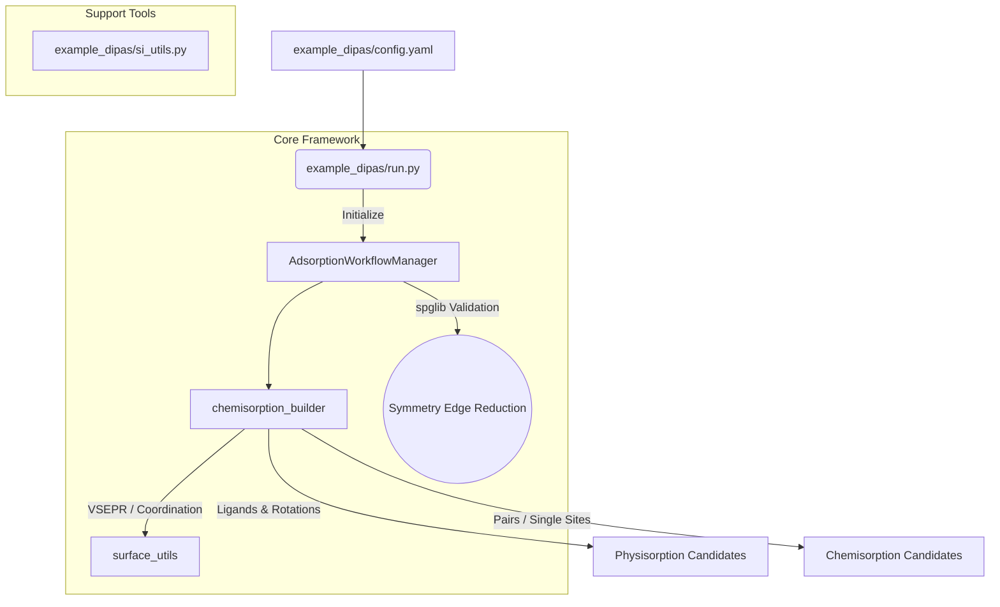

# AutoFlow-SRXN: Automated Surface Reaction Workflow

**AutoFlow-SRXN** is an advanced, fully-automated framework designed for high-throughput exploration and generation of adsorption and reaction structures between arbitrary precursors and substrates.

---

## 🚀 Key Features

### 1. Config-Driven Generic Setup
- **Centralized Control**: Powered by an easily customizable `config.yaml` to define substrates, target center atoms (e.g., `'Ni'`, `'Si'`), point group tolerances (`symprec`), and reaction execution scopes.
- **Ideal Coordination Logic**: Bypasses hardcoded reactivity rules. Uses elementary "ideal coordination" (VSEPR theory approximation) to autonomously detect undercoordinated surface atoms and calculate exact 3D orientation for missing Dangling Bonds.
- **Translational Symmetry Processing**: Generates an exhaustive combination of active sites, but autonomously prunes symmetrically redundant structures via `spglib`. It robustly groups identical reactive sites and pairs across full periodic boundaries (Translational & Point Groups). 

### 2. Intelligent Precursor Fragmentation
- **Graph-Based Ligand Discovery**: Powered by RDKit & ASE. Extracts explicit ligand detachments (hapticity, binding atoms, and 3D steric vectors) mapping structurally from the controlled `center_target` parameter.
- **Symmetry Deduplication**: Caches and groups ligands by chemical formula, dropping identical detached fragments seamlessly.

### 3. Algorithmic Chemisorption & Physisorption Routers
- **Physisorption Engine**: Spherical rigid-body rotation with multiple collision-checking algorithms. Optimizes global precursor spacing onto target symmetric surface sites.
- **Dissociative Chemisorption Builder**: Algorithmic "Cohesive Dissociation". Maps detached precursor fragments directly onto dynamically targeted VSEPR dangling bond pairs within a customizable `max_pair_dist`.
- **H-Exchange (Single-Site)**: Autonomously calculates optimal byproduct substitution geometry on pre-passivated substrates.

### 4. Thermodynamics & Gibbs Free Energy
- **VDOS Integration**: Fully parses Phonopy Vibration Density of States data to obtain $ZPE$, $S_{vib}(T)$, and $G_{vib}(T)$.
- **Phase-specific Modes**:
  - **Gas Mode**: Sackur-Tetrode equation, rotational corrections, and Enthalpy ($PV$) term handling for detached byproducts.
  - **Adsorbate Mode**: Specialized harmonic solid formulation suited for rigid surface models.
  
---

## 🏗️ Architecture



### Core Flow Directories (`src/`)
- `src/ads_workflow_mgr.py`: Core Adsorption workflow interface. Handles logic for collision mapping, atomic overlap testing, and periodic parameter extraction.
- `src/chemisorption_builder.py`: Geometry-based generalized reactivity router. Identifies missing valences and steers generation pathways without relying on hardcoded element checks.
- `src/surface_utils.py`: Platform-independent tools to extract general structural properties and overlap heuristics.

### Specialty Modules
- `example_dipas/`: Executable sandbox environment. Houses specialized utilities (e.g., `si_surface_utils.py` for highly focused empirical Si(100) manipulation) and the configurable dataset runner `run.py`.
- `free_energy/`: Self-contained statistical-mechanics parser to calculate thermodynamic property parameters via command line.

---

## 🛠️ Quick Start

To run the framework dynamically using `SiO2` and Precursor `mol.vasp`:

```bash
cd example_dipas
python run.py
```
*Based on `config.yaml`, the engine will auto-detect underlying periodicity, generate generic ligand fragments, apply VSEPR rules to identify undercoordinated O/Si atoms, evaluate translational symmetric bonding pairs, and output unique atomic configurations into `.extxyz` files (e.g., `cands_sio2_chem.extxyz`).*

### 🌡️ Thermodynamics Engine
To calculate Free Energy via Phonopy outputs:
```bash
cd free_energy
# Gas Phase calculation (Mass 18.015, Symmetry 2)
python analyze_thermo.py phonopy.yaml --energy -14.5 --mode gas --mass 18.0 --sigma 2

# Adsorbent solid structure analysis
python analyze_thermo.py phonopy.yaml --energy -500.4 --mode adsorbent
```

---
## 📝 Contact
This framework was fundamentally structured for High-Throughput High-Fidelity material interface screening capabilities. Please reach out to the project maintainers if you intend to merge custom reaction heuristic components.
